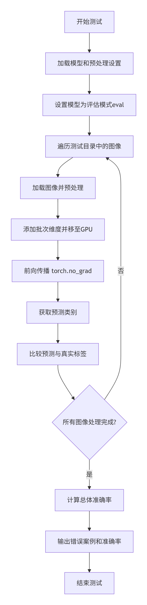

# FalcoVision - 图像分类项目

本项目使用PyTorch和ResNet18架构实现了一个图像分类系统。它可以根据训练好的模型将图像分类到不同的类别中。

## 功能特点

- 使用ResNet18预训练模型进行图像分类
- 实现迁移学习
- 支持GPU加速
- 包含完整的训练和测试脚本
- 数据预处理和增强功能

## 工作流程

### 训练流程


### 测试流程


## 项目结构

```
FalcoVision/
├── train.py          # 训练脚本
├── test.py           # 测试/评估脚本
├── savedmodel.pth    # 保存的训练模型权重
├── README.md         # 中文说明文件
├── README_EN.md      # 英文说明文件
├── train/            # 训练数据目录（需用户创建）
│   ├── class1/       # 类别1的图像
│   ├── class2/       # 类别2的图像
│   └── ...           # 其他类别
└── test/             # 测试数据目录（需用户创建）
    ├── class1/       # 类别1的测试图像
    ├── class2/       # 类别2的测试图像
    └── ...           # 其他类别
```

## 环境要求

- Python 3.6+
- PyTorch
- TorchVision
- PIL (Pillow)

使用以下命令安装依赖：
```bash
pip install torch torchvision pillow
```

## 使用方法

### 1. 准备数据

按以下结构组织您的数据：
- 创建一个`train`目录，其中包含每个类别的子目录
- 创建一个`test`目录，具有相同的子目录结构

示例：
```
train/
├── cats/
│   ├── cat1.jpg
│   ├── cat2.jpg
│   └── ...
└── dogs/
    ├── dog1.jpg
    ├── dog2.jpg
    └── ...
```

### 2. 训练模型

运行训练脚本：
```bash
python train.py
```

训练好的模型将保存为`savedmodel.pth`。

### 3. 测试模型

训练完成后，在测试数据上评估模型：
```bash
python test.py
```

## 配置说明

### 训练参数 (在train.py中)
- `num_epochs`: 训练轮数 (默认: 25)
- `batch_size`: 训练批次大小 (默认: 32)
- `learning_rate`: 优化器学习率 (默认: 0.0005)

### 模型架构
- 基础模型: ResNet18 (在ImageNet上预训练)
- 自定义分类器: 适应类别数量的线性层